# Rock Paper Scissors Lizard Spock
* A fun twist on the traditional Rock Paper Scissors game. 

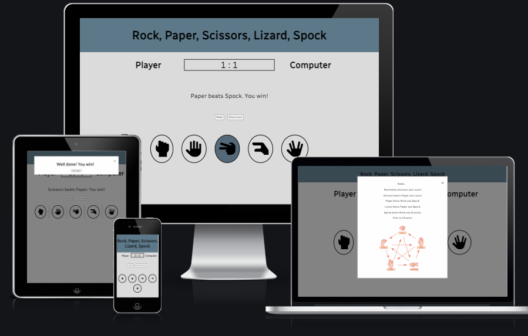

# The Goal for this Project

    The goal of this project is to entertain users while giving them a seemless experience. The project was inspired by Code Institue and their example projects.

# Table of Contents

 + [UX](#ux "UX")
    + [User Goals](#user-goals "User Goals")
    + [User Stoies](#user-stories "User Stories")
    + [Site Owner's Goals](#site-owners-goals "Site Owner's Goals")
    + [Requirements](#requirements)
    + [Design Choices](#design-choices)
     + [Fonts](#fonts)
     + [Icons](#icons)
    + [Colours](#colours)
 + [Features](#features)
    + [Existing Features](#existing-features)
    + [Future Feature](#future-features)
 + [Technologies Used](#technologies-used)
    + [Languages](#languages)
    + [Libraries and Frameworks](#libraries-and-frameworks)
    + [Tools](#tools)
 + [Testing](#testing)
    + [Additional Testing](#aditional-testing)
    + [Unfixed Bugs](#unfixed-bugs)
+ [Deployment](#deployment)
    + [GitHub Pages](#github-pages)
+ [Credits](#credits)

# UX

## User Goals

+ The game should be easy to navigate and use on all platforms. 
+ The game should be fun and competitive.
+ The game should look modern and intuitive.
+ The game should work without any glitches or faults.

## User Stories

+ As a user, I want to be engaged in the game and feel absorbed by the UI and gameplay.
+ As a user, I want to see the results after the game is finished.
+ As a user, I want to play a game intuitively.
+ As a user, I want the game to be sleek and modern in design.

## Site Owner's Goals

+ To create a working game that is fun and easy to use.
+ To create a sleek and well designed game.
+ To write code that follows best practice.
+ The code can be easily understood and adapted.

## Requirements 

+ Easy to play and understand.
+ Should work on any device and browser.
+ The game should be fun and competitive.
+ The game should be quick to load and contain minimal lag

\
&nbsp;
[Back to Top](#table-of-contents)
\
&nbsp;

# Design Choices

## Fonts 
I used [Google Fonts](https://fonts.google.com/ "Google Fonts") to find a text that suited the sleek modern design of the website. The font I chose was [Radio Canada](https://fonts.google.com/?query=Radio+Canada ). I felt this font was very clear and blended very well with the overall design.

## Icons 
I chose to use the very suitable icons from [Font Awsome Library](https://fontawesome.com/ "Font Awesome"). These icons seemed modern and easy to distinguish at a glance.

## Colours 

Initially I used [Coolors](https://coolors.co/ "Coolors") to generate the colour palette which would later be altered slightly during [testing](###color-contrast-heading "Testing") for a colour which had a better contrast. 

The main colours used were: 

* --#DBDBDB in the body.
* --#5D7989 in the heading.
* --#000000 as the font and icon color.

These can be seen in the responsive design [above](#rock-paper-scissors-lizard-spock).

In addition Green and Red were used as a box-shadowing to indicate whether the user answered corretly or incorrectly. The heading color was used to indicate a draw. 

# Features

## Existing Features

### Header 
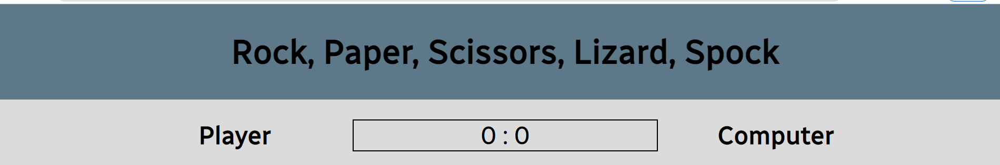
\
&nbsp;
+ The Header located at the top of the page has a contrasting background color which helps itstand out.
+ The title of the game can be seen clearly.

### Scoreboard

+ Also visible above is the scoreboard feature which allows the user to compete against the computer.
+ Both the player and the computer log their scores into the scoreboard.

### Buttons 
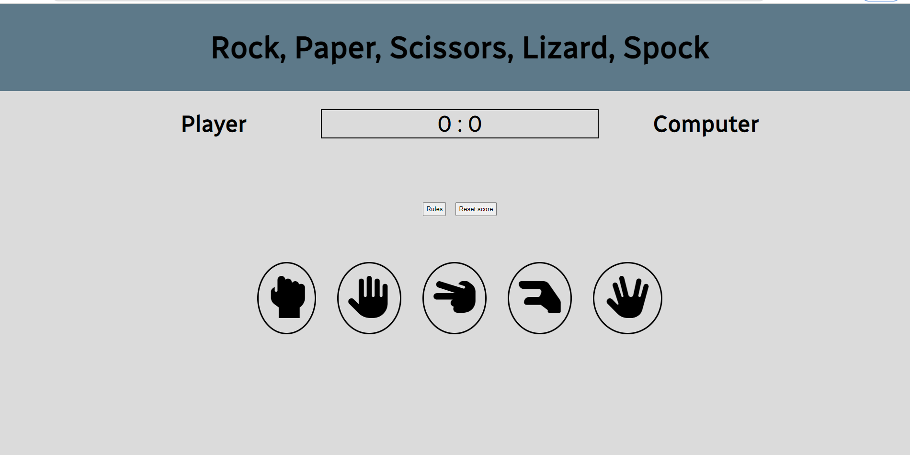

+ The buttons are five icons taken from [Font Awsome Library](https://fontawesome.com/ "Font Awesome").
+ The contrast between the black buttons and the body of the page make the buttons stand out.
+ The buttons change color to that of the header when hovered over or clicked.
+ The buttons also have a box shadow when clicked which helps indicate to the user if they were correct or not.
\
&nbsp;
### Result Message
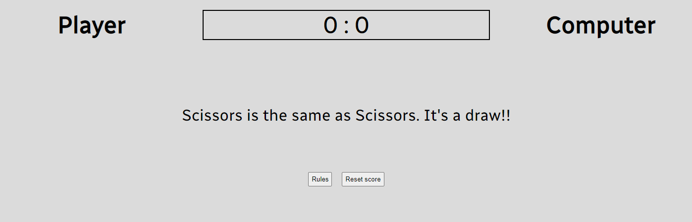

+ The result message indicates to the user what they picked.
+ A secondary message also indicates whether they won or lost.

\
&nbsp;

### Rules

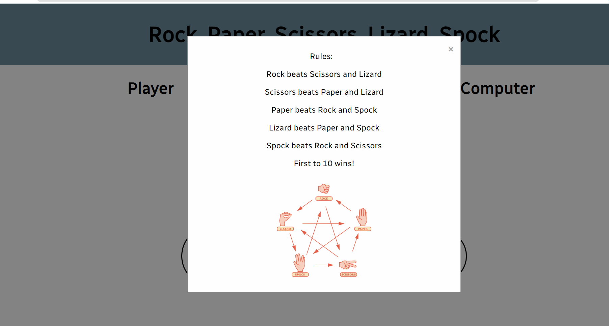

+ The rules are a modal pop up.
+ They inform the user how to play and the number of points needed to win.
\
&nbsp;

### Player Win Message
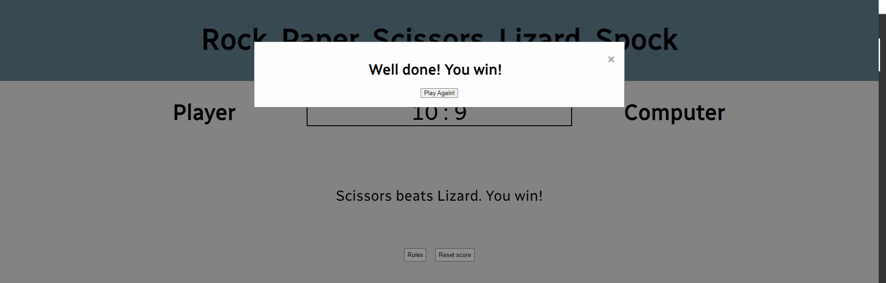

+ The message informs the user if they have reached 10 points and won the game.
+ The message is a modal pop up which contains a button to play again.
+ The play again button also resets the score.
+ If the user closes the message the modal disapears but the score does not reset.
\
&nbsp;

### Computer Win Message
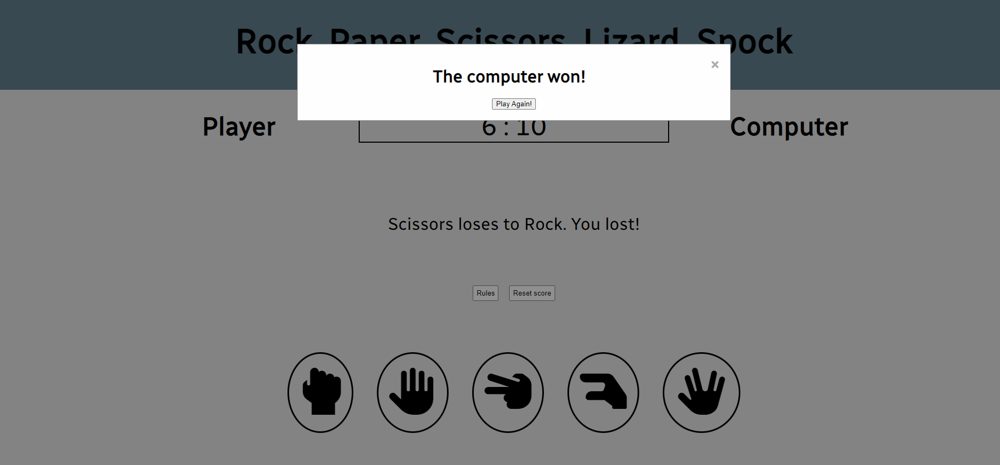

+ The message informs the user if the computer has reached 10 points and that they have lost the game.
+ The message is a modal pop up which contains a button to play again.
+ The play again button also resets the score.
+ If the user closes the message the modal disapears but the score does not reset.
\
&nbsp;

## Future Features
+ I plan to add a turns counter which will allow the user to keep track of rounds.
+ I would like to implement a countdown and a Start Game button.
+ I would like to include a footer with a link to my Github.

# Technologies Used

## Languages

+ [HTML](https://en.wikipedia.org/wiki/HTML "HTML")
+ [CSS](https://en.wikipedia.org/wiki/CSS "CSS")
+ [JavaScript](http://en.wikipedia.org/wiki/JavaScript "JavaScript")

## Libraries & Framework

+ [Google Fonts](https://fonts.google.com/ "Google Fonts")
+ [Font Awesome library](https://fontawesome.com/ "Font Awesome")

## Tools

+ [GitHub](https://github.com/ "GitHub")
+ [Gitpod](https://www.gitpod.io/ "Gitpod")
+ [W3C HTML Validation Service](https://validator.w3.org/ "W3C HTML")
+ [W3C CSS Validation Service](https://jigsaw.w3.org/css-validator/ "W3C CSS")
+ [JSHint](https://jshint.com/ "JSHint")
+ [Coolors](https://coolors.io/ "Coolors")
+ [Favicon Converter](https://favicon.io/favicon-converter/)

\
&nbsp;
[Back to Top](#table-of-contents)
\
&nbsp;

# Testing

+ After some feedback from my mentor and friends I decided to add the hover and box shadow on the buttons to highlight the user's choice. I also made it possible to view the score by closing the message at the end of the game. 
+ I have checked the game in several browsers and using several different devices of varying screen size. 
+ A challenege I faced was keeping the integrity of the game as the while playing across smaller screens.
+ In addition during the testing stage I noticed that my heading colour did not contrast well enough with the blackfont header. To fix this I change the colour to a lighter shade. 
\
&nbsp;

## Aditional Testing

### W3 HTML Validation
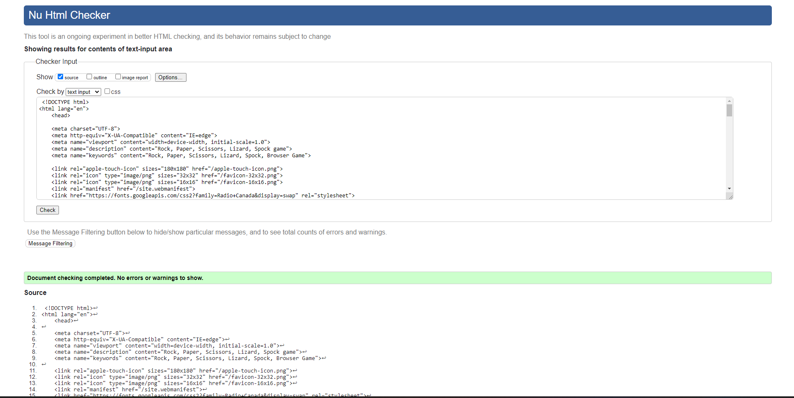

### W3 CSS Validation
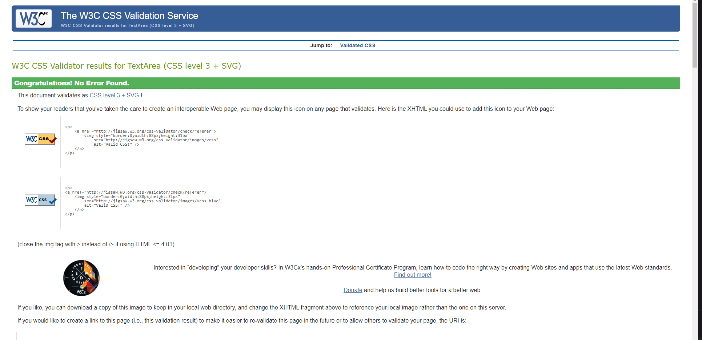

### JSHint Testing
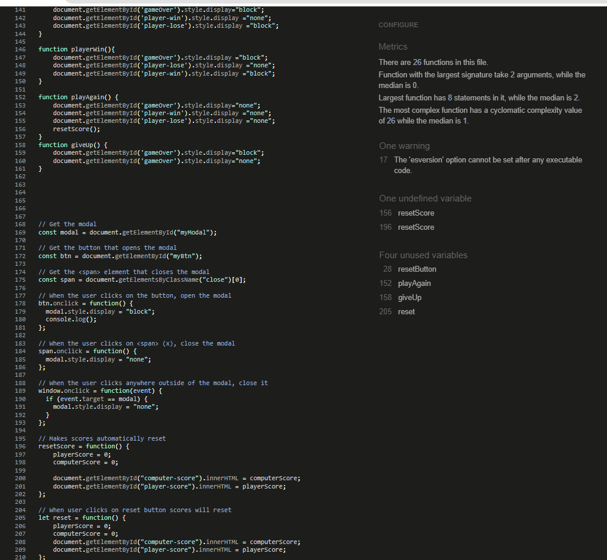

### Lighthouse Testing
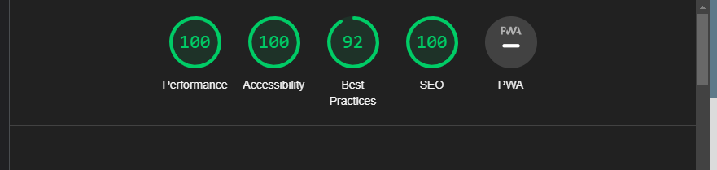

### Colour Contrast Heading
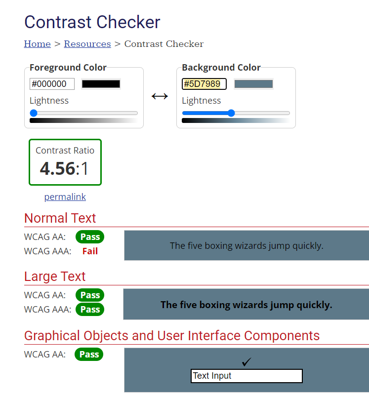

### Colour Contrast Body

## Unfixed Bugs 
+ On smaller devices any atttempt at adding a footer with a link to socials interferred with the game mechanics. As specified I would like to come back and impplement this. 
\
&nbsp;

# Deployment 

After finishing the majority of the project I deployed the site on GitHub using the following steps:

## GitHub Pages
+ Navigate to the repository on GitHub and click 'Settings'.
+ Then select 'Pages' on the side navigation.
+ From the source section drop-down menu, select the 'Main' Branch.
+ Click on the 'Save' button.
+ This is now a live website.
+ Any changes after this point can be done through commits and pushing to GitHub. Once pushed the changes will take a few minutes before becoming live. 
\
&nbsp;

# Credits

For Inspirations relating to code, help and advice. 

+ [Martina Terlevic](https://www.linkedin.com/in/martinaterlevic/ "Martina Terlevic") - Code Institute Mentor.
+ [StackOverFlow] - Help with general questions
+ [W3 Schools](https://www.w3schools.com/howto/howto_css_modals.asp "W3 Schools") - Modal help box.
+ [Whatsdev](https://www.youtube.com/watch?v=qipq1BV5myU "Whatsdev") - Help with general functionality and box shadowing.
+ [Code Institute] - For their lessons on coding and the example projects which was a base to work from. 
+ [Ania Kubow](https://www.youtube.com/watch?v=RwFeg0cEZvQ "Code with Ania Kubow") - Help with switch case.

For help with Content.

+ Explanation image taken from [Openclipart](https://openclipart.org/detail/325665/rock-paper-scissors-lizard-spock) - Explanation image
+ Favicon image taken from pinterest [Pinterest](https://br.pinterest.com/pin/471189179763434016/?amp_client_id=CLIENT_ID(_)&mweb_unauth_id={{default.session}}&simplified=true)
+ Icons taken from Font Awesome[Font Awsome Library](https://fontawesome.com/ "Font Awesome").

